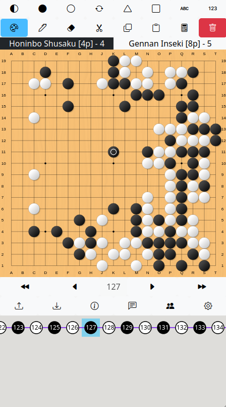

# Board

Put stones on it. Like a real board.

Go to [Board](https://board.tripleko.com)

This project is free and open-source and always will be. Feel free to contribute by submitting changes, reporting bugs, suggesting features, or just sharing with friends.
